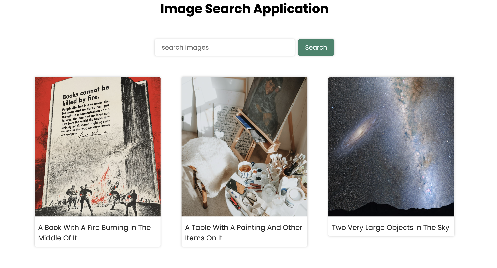

# README

## Description
This code consists of three modules,`data.mjs`, `search.mjs` and `random.mjs`, which fetch images from the Unsplash API based on user input and fetch randomly selected images once you upload or refresh the application . 

The `search.mjs` module fetches images based on a user-provided search query, while the `random.mjs` module fetches random images every time you upload the page.

## Modules

### `search.mjs`
- This module is responsible for handling user search queries and displaying corresponding images.
- It exports a function named `getPhotos()` that retrieves images based on the user's search query.
- It listens for user input and triggers the `getPhotos()` function accordingly.

### `random.mjs`
- This module is responsible for fetching random images from the Unsplash API.
- It exports three functions: `getRandomPhotoOne()`, `getRandomPhotoTwo()`, and `getRandomPhotoThree()`, each fetching a random image and displaying it on a designated HTML element.

## my GitHub link:

https://github.com/Hrais12/SBA-308A-JavaScript-Web-Application

